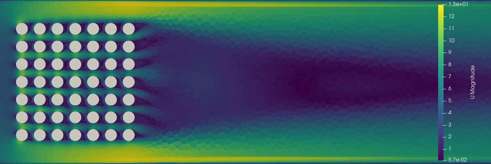
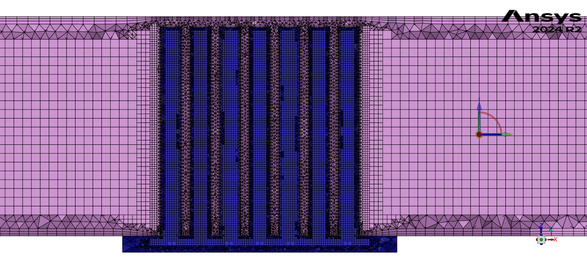
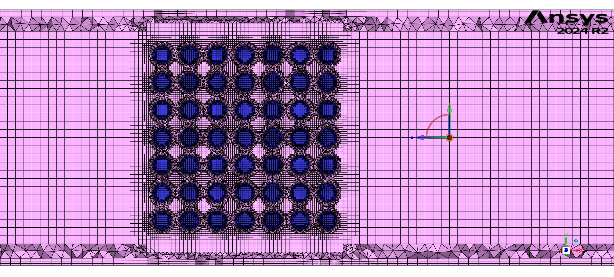

# OpenFOAM v13 - CHT Pin Fin Heatsink (kw SST)

Steady-state conjugate heat transfer simulation of a pin fin heat sink placed in a rectangular duct.  
25 W heater is placed underneath the heat sink.  
Turbulence model: **kw SST**

### Meshing Workflow
Detailed meshing guide: [meshing-guide.md](meshing-guide.md)

**Materials:**
- Heat sink: AlSi12
- Fluid: Air at 20°C

**Setup:**
- Ansys 2024 R2
- OpenFOAM v13
- Mesh imported from Fluent Meshing using `fluent3DMeshToFoam`
- Polyhedral mesh

**Mesh views (from Fluent Meshing):**

